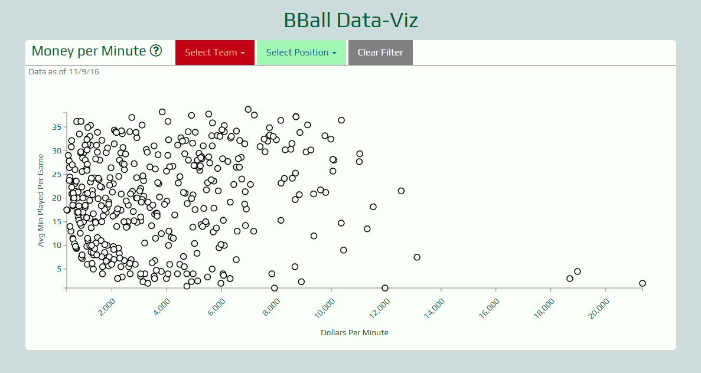

Meetup Finder
======

### Summary

This app displays the amount of money NBA players are making per minute. Salary is based on the 2016-2017 season's salary data. 
I took the salary and divided it by the total number of games in a season, 82. I then took the average number of minutes a players
plays per game. Dividing the salary per game into the avg Minutes played gives me the data I was looking for.

### Technology Used

HTML/CSS/JavaScript/jQuery/Mongoose/MongoDB/Node/D3.js